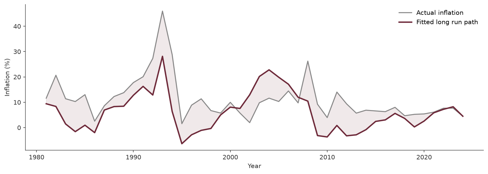

# The Fiscal-Monetary Nexus in Kenya: Does Public Debt Drive Inflation?

This project examines whether Kenya's public debt burden has a measurable long run relationship with inflation, using ARDL bounds testing on annual World Bank data from 1980 to 2024. It builds on two earlier projects, a standalone Kenya inflation analysis and a Kenya debt sustainability analysis, by testing the fiscal-monetary transmission channel that connects them.

The preferred model is ARDL(0,1,0), selected using BIC, retaining external debt to GNI and debt service to exports as the two explanatory variables. The bounds test produces an F-statistic of 8.94, which clears every critical value bound including at the 99.9 percent confidence level, confirming a genuine long run cointegrating relationship. The error correction term of -0.798 indicates that around 80 percent of any deviation from the long run path closes within a single year.

## Live Dashboard

https://kenya-fiscal-monetary-nexus-6ofxjdn85me5a8ia6vpgbi.streamlit.app/

## Research Question

Does Kenya's public debt have a measurable long run relationship with inflation, and if so, through which channel does that relationship operate?

## Data

World Bank World Development Indicators, 1980 to 2024. Five variables: inflation, external debt to GNI, debt service to exports, exchange rate, and broad money supply.

## Method

Augmented Dickey-Fuller unit root tests confirmed that inflation is I(0) and all other variables are I(1), satisfying the precondition for ARDL bounds testing. Lag selection used VAR-based information criteria, which pointed to a maximum lag of 1. The bounds test was run under case 3, a constant included in the model but excluded from the formal test, following Pesaran, Shin, and Smith (2001).

## Key Findings

The bounds test F-statistic of 8.94 clears every critical value bound, confirming cointegration. External debt to GNI has a positive long run effect on inflation of 0.27 percentage points per unit increase. Debt service to exports has a negative long run effect of -0.32 percentage points, likely through a tightening of foreign exchange available for domestic spending. Exchange rate and broad money added no explanatory power once the two debt variables were included, consistent with the high correlation between all four variables identified in exploratory analysis.

The near-zero simple correlation between inflation and debt service to exports at 0.069 illustrates why econometric modelling adds value beyond correlation analysis. The long run relationship only becomes visible once the time series structure of the data is properly accounted for.

## Related Projects

- [Kenya Inflation Drivers Analysis](https://github.com/Loreenatenge/kenya-inflation-analysis)
- [Kenya Debt Crisis Analysis](https://github.com/Loreenatenge/kenya-debt-crisis-analysis)

## Tools

Python, pandas, statsmodels, matplotlib, seaborn, Streamlit

## Author

Loreen Ateng'e, Economics and Statistics, University of Nairobi. 
